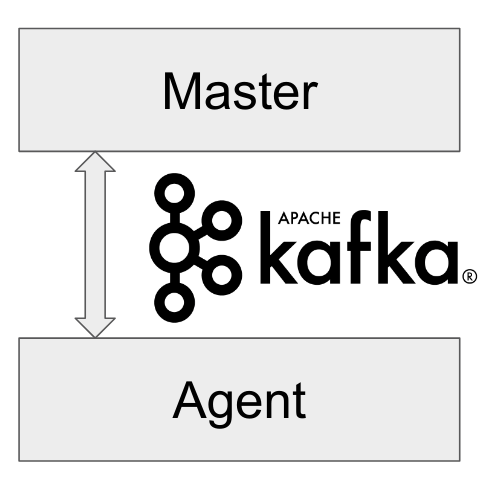

# Remoting Kafka Plugin

[](https://ci.jenkins.io/job/Plugins/job/remoting-kafka-plugin/job/master/)
[](https://gitter.im/jenkinsci/remoting?utm_source=badge&utm_medium=badge&utm_campaign=pr-badge&utm_content=badge)

This plugin can be found in [Jenkins Plugin](https://plugins.jenkins.io/remoting-kafka).



Slides for DevOps World | Jenkins World 2018 presentation [available here](https://docs.google.com/presentation/d/1drRIDNvDKdBE-VuuLFXlWRB0NhSFr1aWrg2p8qrF3co/edit?usp=sharings).

## Overview

Current versions of Jenkins Remoting are based on the TCP protocol. If it fails, the agent connection and the build fails as well. There are also issues with traffic prioritization and multi-agent communications, which impact Jenkins stability and scalability.

This project aims an update of Remoting and Jenkins in order to add support of a popular message queue/bus technology (Kafka) as a fault-tolerant communication layer in Jenkins.

More information about this project can be found at: https://jenkins.io/projects/gsoc/2018/remoting-over-message-bus/

## Release Notes

See the [CHANGELOG](CHANGELOG.md).

## Developer documentation

- [Contributing](docs/CONTRIBUTING.md)
- [Technical Documentation](docs/DOCUMENTATION.md)
- [Report an issue](https://issues.jenkins-ci.org/browse/JENKINS-53417)

## How to run demo of the plugin

### Using Docker

1. Requirements: docker, docker-compose installed.

2. Set environment variable `DOCKERHOST`

- Windows: `set DOCKERHOST=host.docker.internal`
- macOS: `export DOCKERHOST=host.docker.internal`
- Linux: `export DOCKERHOST=$(ifconfig docker0 | grep 'inet addr:' | cut -d: -f2 | awk '{ print $1}')`

3. Build the demo: `make all`.

4. Run the demo: `make run` (without security feature `make run-no-auth`).

5. Features in the demo:

- Docker Compose starts preconfigured Master and agent instance, they connect automatically using Kafka launcher.
- Kafka is secured and encrypted with SSL.
- There few demo jobs in the instance so that a user can launch a job on the agent.
- Kakfa Manager supported in localhost:9000 to support monitoring of Kafka cluster.

6. Stop the demo: `make clean`.

### Using Kubernetes

1. Requirements: A Kubernetes cluster (e.g. minikube), Helm 2

2. Run the demo:

```bash
helm dep build helm/jenkins-remoting-kafka && \
  helm install helm/jenkins-remoting-kafka -n demo -f demo/helm/values-override.yaml
```

3. Stop the demo:

```bash
helm delete --purge demo
```

## Links

- [JIRA issues](https://issues.jenkins-ci.org/browse/JENKINS-53417)
- [Wiki](https://wiki.jenkins.io/display/JENKINS/Remoting+Kafka+Plugin)
- [Project Info](https://jenkins.io/projects/gsoc/2018/remoting-over-message-bus/)
- [Introduction Blogpost](https://jenkins.io/blog/2018/06/18/remoting-over-message-bus/)
- [1.0 Release Blogpost](https://jenkins.io/blog/2018/07/23/remoting-kafka-plugin-1/)
- [Phase 1 Evaluation Slides](https://docs.google.com/presentation/d/1GxkI17lZYQ6_pyAOR9sXNXq1K3LwkqjigXdxxf81VkE/edit?usp=sharing)
- [Phase 2 Evaluation Slides](https://docs.google.com/presentation/d/1TW31N-opvoFwSkD-FChhjCsXNWmeDjkecxJv8Lb6X-A/edit?usp=sharing)
- [Phase 3 Evaluation Slides](https://docs.google.com/presentation/d/1DspO4nXEzbvDhrv4xY41xqCfjgHzYM5rLxmKbVnQV1Y/edit?usp=sharing)
- [Phase 1 Evaluation Video](https://youtu.be/qWHM8S0fzUw)
- [Phase 2 Evaluation Video](https://youtu.be/tuTODhJOTBU)
- [Phase 3 Evaluation Video](https://youtu.be/GGEtN4nbtng)
- [Jenkins World Presentation Slides](https://docs.google.com/presentation/d/1drRIDNvDKdBE-VuuLFXlWRB0NhSFr1aWrg2p8qrF3co/edit?usp=sharing)
