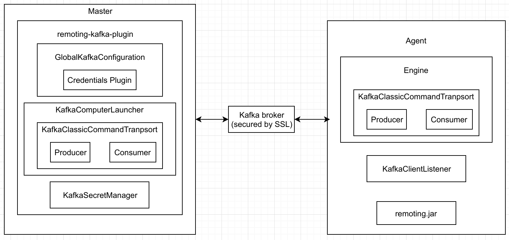
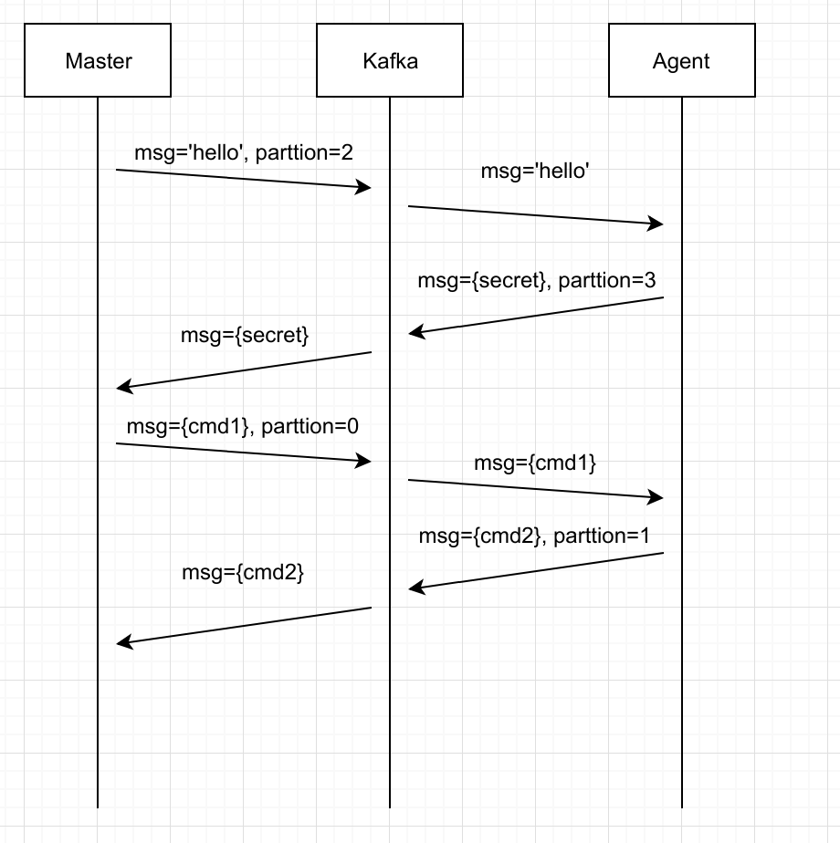

# Technical Documentation

This documentation is to give a technical overview of Remoting Kafka Plugin. To try a demo of the plugin, please visit our [demo](/README.md#how-to-run-demo-of-the-plugin) section.

## Overview

Current versions of Jenkins Remoting are based on the TCP protocol. If it fails, the agent connection and the build fails as well. There are also issues with traffic prioritization and multi-agent communications, which impact Jenkins stability and scalability.

This project aims an update of Remoting and Jenkins in order to add support of a popular message queue/bus technology (Kafka) as a fault-tolerant communication layer in Jenkins.

## Architecture

The below picture gives an overview architecture of the plugin.

All command invocations, RMI, class loading, data streaming between master and agent are now transfered to/from a Kafka broker.

## Communication model

The plugin uses manual partition assignment for topic management in Kafka. A master-agent connection will create a topic on the fly with 4 partitions:

* Partition 0: command from master to agent.

* Partition 1: command from agent to master.

* Partition 2: secret message from master to agent.

* Partition 3: secret message from agent to master.

## Shared components (kafka-client-lib)

Shared components to be reused between master and agent, with the core [KafkaClassicCommandTransport](/kafka-client-lib/src/main/java/io/jenkins/plugins/remotingkafka/commandtransport/KafkaClassicCommandTransport.java). This is the core of the plugin, an extension of Jenkins [CommandTransport](https://github.com/jenkinsci/remoting/blob/master/src/main/java/hudson/remoting/CommandTransport.java), which supports command transports to/from Kafka.

## Plugin componenents

* [GlobalKafkaConfiguration](/plugin/src/main/java/io/jenkins/plugins/remotingkafka/GlobalKafkaConfiguration.java): extension of GlobalConfiguration in Jenkins, where users can input Kafka/Zookeeper connection string. [Credentials Plugin](https://github.com/jenkinsci/credentials-plugin) is being used for to ensure security input of Kafka secrets.
* [KafkaSecretManager](/plugin/src/main/java/io/jenkins/plugins/remotingkafka/KafkaSecretManager.java): exchange secret (using HMAC algorithm) between master and agent to ensure a correct connection between master and agent.

## Agent components

* [Engine](/agent/src/main/java/io/jenkins/plugins/remotingkafka/Engine.java): A rewritten version of remoting original [Engine](https://github.com/jenkinsci/remoting/blob/master/src/main/java/hudson/remoting/Engine.java) to support Kafka transport.
* [KafkaClientListener](/kafka-client-lib/src/main/java/io/jenkins/plugins/remotingkafka/KafkaClientListener.java): A listener thread to listen to incoming messages from Kafka and produce outgoing response messages. To be used as a secret listener in agent.
* remoting.jar bundling [JENKINS-52871](https://issues.jenkins-ci.org/browse/JENKINS-52871).
